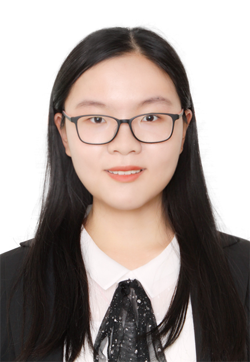

# **左 佳**
<!--  -->
<!--  -->
<!--  -->
<!--
include contact information from the front matter
Supported arguments:
    - homepage: url, text
    - phone
    - email
-->



<div>
  <div style="float: right;margin-right: 10px;">
     <!-- 5px 5px 5px rgba(0,0,0,.5);-->
  </div>
</div>
## **教育背景**

### **哈尔滨工业大学（威海）** `2019/9 - 至今`

```
威海, 中国
```
- 在读本科生，预计 2023 年毕业
- 专业：测控技术与仪器
- GPA：80.71/100     3.23/4.00
- 语言：CET-6     IELTS: 6.0

## **领导经历**

### **718 智能车实验室** <!-- (https://zuozuojia.github.io/posts/Introduction/)-->
- **负责人** `2020/09 – 2021/09`
<br> 

实验室被誉为校内科创“黄埔军校”，以智能车赛事为平台，针对大一新生进行系统化的培养，为各高阶实验室输送人才，每年受众面达千余人。任职期间将实验室技术体系进行了扩展，由以电控为主型转化为电控、计算机视觉、结构设计高度交叉融合型。 <br>
 <!-- 
[[PDF]({{ page.homepage.url }}/assets/uist-21-recode.pdf)]
[[BibTeX]({{ page.homepage.url }}/assets/uist-21-recode.txt)]
[[video preview](https://youtu.be/fMdHK9UrgQ4)]
[[talk](https://youtu.be/_GQ8E7EMMws)]-->

### **HERO 竞技机器人** <!-- (https://zuozuojia.github.io/posts/Introduction/)`2020/9 – 至今`-->
- **副队长， 项目管理** `2021/01 – 2021/08`
<br> 

参加 RoboMaster2021 赛事，4 个月时间接手副队长职务，协助队长管理团队项目研发，同时负责嵌入式算法工作，重点完成了步兵英雄机器人代码系统化重构与云台控制算法优化。 <br>
 <!-- 
[[PDF]({{ page.homepage.url }}/assets/uist-21-recode.pdf)]
[[BibTeX]({{ page.homepage.url }}/assets/uist-21-recode.txt)]
[[video preview](https://youtu.be/fMdHK9UrgQ4)]
[[talk](https://youtu.be/_GQ8E7EMMws)]-->

- **队长** `2021/09 – 至今`
<br> 

RoboMaster 新赛季升任队长职务，统筹管理，对 HERO 机器人战队进行了重组，由原来“122 型”（1 个牌子 2 个团队 2 个项目）转换为“112 型”（1 个牌子 1 个团队 2 个项目），优化资源配置，促进技术协同，梳理适合团队的项目管理流程。同时负责电控技术组。 <br>
 <!-- 
[[PDF]({{ page.homepage.url }}/assets/uist-21-recode.pdf)]
[[BibTeX]({{ page.homepage.url }}/assets/uist-21-recode.txt)]
[[video preview](https://youtu.be/fMdHK9UrgQ4)]
[[talk](https://youtu.be/_GQ8E7EMMws)]-->

### **数学建模大赛** <!-- (https://zuozuojia.github.io/posts/Introduction/)-->
- **组长** `2020/09 – 2021/11`
<br> 

参加 4 场建模大赛，对数学知识有了新的认识，同时积累了文献撰写经验，为科学的技术研究提供支撑。 <br>


## **项目研发经历**
**718 智能车实验室**`2019 – 2021`

2019/11 – 2020/09 **嵌入式软件开发**
<br> 
- 自平衡两轮智能车 全国大学生智能车竞赛

基于串级 PID 控制器的两轮直立车的平衡和运动算法。基于 PID 控制器的电磁循迹算法。适应复杂路段（例如环岛、急转弯、坡道等）的循迹算法。
- 智能手表 全国大学生电子设计大赛

使用 OLED 和按键进行人机交互，实现菜单算法。测量体温，并自动刷新、绘制温度随时间变化的折线图。抬腕自动亮屏、放下自动熄屏、自动检测睡眠姿态防亮屏算法。检测运动状态，记录步数。
<br>
 <!-- 
[[PDF](http://penrose.ink/media/Penrose_SIGGRAPH2020.pdf)]
[[BibTeX]({{ page.homepage.url }}/assets/siggraph20-penrose.txt)]
[[www](http://penrose.ink/siggraph20.html)]
[[repo](https://github.com/penrose/penrose)]-->

**HERO 竞技机器人队** RoboMaster 机甲大师高校系列赛 `2020/09 – 至今`

2020/09 – 至今 **嵌入式软件开发**
<br> 
- 基于 RT-Thread 的全机器人电控软件

机器人的电控云台代码设计和编写，包括：基于串级 PID 的两轴云台控制、基于特殊 PID 的陀螺仪的温度控制器算法、遥控控制机器人发弹、运动等算法、基于视觉的自动瞄准打击目标算法等。修复 RT-Thread 中关于 CAN、PWM 等外设驱动代码错误。
- 基于 RT-Thread 的电机智能控制板软件

实现电机自动初位置校准、自动角度/转速闭环、主从机掉线自动处理机制、电机堵转掉线报警等。
<br>

2021/01 – 2021/04	**视觉/算法开发**
<br> 
- 抗干扰的自适应曝光算法

自动识别并抠除窗户等大光斑，利用 PI 控制器实现自动曝光，以便后期目标检测。
<br>
 <!-- 
[[PDF](http://penrose.ink/media/Penrose_SIGGRAPH2020.pdf)]
[[BibTeX]({{ page.homepage.url }}/assets/siggraph20-penrose.txt)]
[[www](http://penrose.ink/siggraph20.html)]
[[repo](https://github.com/penrose/penrose)]-->

**数学建模竞赛 4 场**`2020/09 – 2022/02`

2020/09 – 至今	**队长**
<br> 
- 使用 Python、MatheMatica，完成模型建立、随机地图生成、最短路径算法以及可视化处理。
- 使用 Python，完成 TOPSIS 综合分析、灰色关联分析，使用 Networkx 实现节点影响力可视化。
- 使用 Python 和 SPSS 建模，使用多因素方差分析、Spearman 相关系数分析、MLP 探究乙醇催化偶合制备 C4 烯烃工艺条件的优化问题。
- 建模探究世界公平的影响因素，并进行论文的撰写。
<br>
 <!-- 
[[PDF](http://penrose.ink/media/Penrose_SIGGRAPH2020.pdf)]
[[BibTeX]({{ page.homepage.url }}/assets/siggraph20-penrose.txt)]
[[www](http://penrose.ink/siggraph20.html)]
[[repo](https://github.com/penrose/penrose)]-->


## **IT 技能**
- 编程语言：C > Python > C++ > 汇编 > Verilog
- 平台：STM32，MSP430，STC，LPC，Linux
- 软件工具：熟练使用 Keil、IAR、LabView、SPSS，熟悉 MATLAB、Webots、Solidworks
- 嵌入式实时系统 (RTOS)：RT-Thread


## **获奖情况**
**国家级奖项**
- 2nd, 第二十届全国大学生机器人大赛 ROBOMASTER 2021 机甲大师超级对抗赛全国赛 `2021/8`
- 2nd, 2021 年高教杯全国大学生数学建模竞赛本科生组 `2021/11`

**区级奖项**
- 1st, 第二十届全国大学生机器人大赛 ROBOMASTER 2021 机甲大师超级对抗赛区域赛北部赛区 `2021/8`

**省级奖项**
- 1st, 第十一届山东省大学生科技节-科技馆展品创意与制作设计大赛 `2019/11`
- 2nd, 全国大学生数学建模竞赛山东赛区 `2020/10`
- 2nd, 全国大学生电子设计大赛山东赛区 `2020/10`

**荣誉称号及奖学金**
- 科技创新奖学金, 哈尔滨工业大学（威海）2019-2020 春季学期 `2020/06`
- 科技创新奖学金, 哈尔滨工业大学（威海）2019-2020 秋季学期 `2020/10`
- 优秀科创个人, 哈尔滨工业大学（威海）2020 年度信息科学与工程学院 `2020/12`
- 优秀学生干部, 哈尔滨工业大学（威海）2019-2020 年度 `2020/12`
- 二等奖学金, 哈尔滨工业大学（威海）2020-2021 春季学期 `2021/05`

## **学生工作经历**
- 1902805 班学习委员
- 1902202 班心理委员
- 哈尔滨工业大学（威海）校合唱团成员
- 哈尔滨工业大学（威海）信息科学与技术学院学生会科创中心部员
- 2019-2020 年秋高级电子技术课程助教

## **相关学科成绩（满分 100）**
- 大学计算机：91
- C 语言程序设计：96
- 单片机应用拓展实验：95
- 以项目驱动的高级电子技术综合实验课程：93
- 模拟电子技术实验 A：94
- 虚拟仪器软件设计课程设计：95
- 误差理论与数据处理课程设计：95
- 单片机原理及接口技术课程设计：95

<!-- ### Footer

Last updated: May 2013 -->
